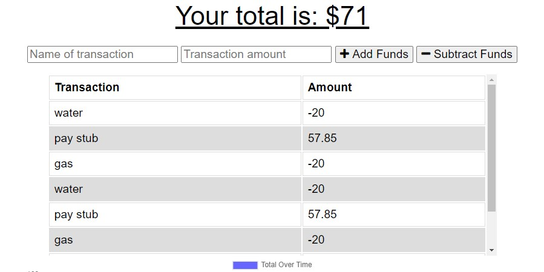
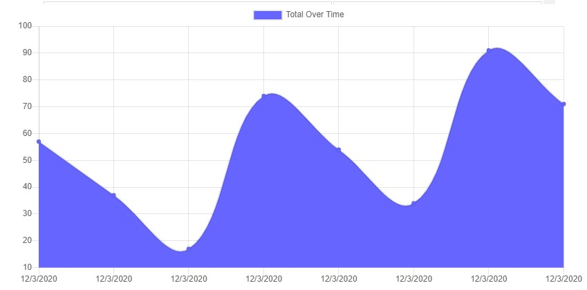

# Budget Tracker 

## Deascription
Budget website PWA to track transactons.

## Table of Contents
- [Description](#description)
- [User Story](#user-story)
- [Acceptance Criteria](#acceptance-criteria)
- [Screenshots](#screenshots)
- [Author](#author)

## User Story
AS AN avid traveler
I WANT to be able to track my withdrawals and deposits with or without a data/internet connection
SO THAT my account balance is accurate when I am traveling 

## Acceptance Criteria
GIVEN a budget tracker without an internet connection
WHEN the user inputs an expense or deposit
THEN they will receive a notification that they have added an expense or deposit
WHEN the user reestablishes an internet connection
THEN the deposits or expenses added while they were offline are added to their transaction history and their totals are updated

## Screenshots

## Author
* [Ann-Marie Orozco](ann760.github.io/myportfolio/) follow the link to see my portfilo website
* [Ann-Marie's git repository](https://github.com/ann760)